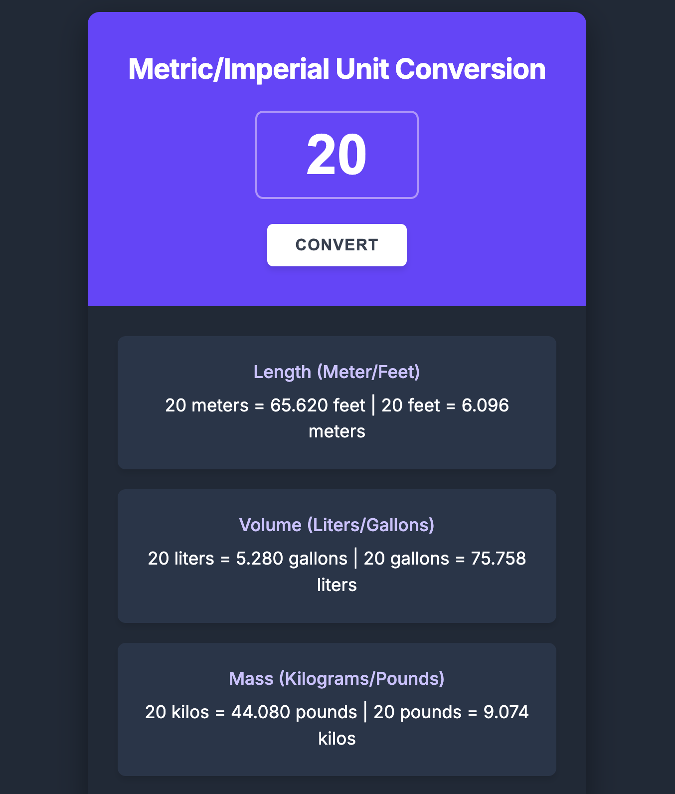

# ⚖️ Metric & Imperial Unit Converter


A sleek, responsive **Unit Converter** built with **HTML5**, **CSS3**, and **Vanilla JavaScript**. Instantly convert lengths, volumes, and masses between Metric and Imperial systems. Designed with a clean, dark-mode inspired UI that looks great on any device.

---
## 📸 Preview


## 🚀 Live Demo

[Open Unit Converter Here](https://yamankadoura.github.io/Unit-Converter/)

---

## ✨ Features

- 📏 **Length Conversion:** Accurately converts between Meters and Feet.
- 💧 **Volume Conversion:** Accurately converts between Liters and Gallons.
- ⚖️ **Mass Conversion:** Accurately converts between Kilograms and Pounds.
- 📱 **Fully Responsive:** Beautifully adapts to mobile, tablet, and desktop screens.
- 🎨 **Modern UI:** Features a sleek dark theme with vibrant purple accents.

---

## 🛠 Technologies

- HTML5 (Semantic Structure)
- CSS3 (Flexbox, custom styling, responsive design)
- Vanilla JavaScript (ES6, DOM Manipulation, Event Listeners)

---

## 📂 Project Structure

```text
Unit-Converter/
│
├── index.html
├── index.css
├── index.js
├── README.md
│
└── images/
    ├── screenshot.png
    └── run_example.gif
```